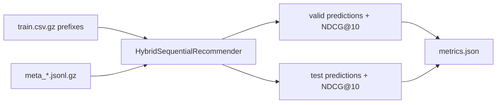

# Amazon Reviews 2023 Sequential Recommender

本项目基于 `PRD.md` 和 `data/` 中的 Amazon Reviews 2023 预切分数据，完成三个类目的 Top-10 序列推荐：

- `Industrial_and_Scientific`
- `Musical_Instruments`
- `CDs_and_Vinyl`

核心预测目标是 `parent_asin`，评估指标是 PRD 指定的 `NDCG@10`。当前实现不依赖 pandas、numpy 或 torch，可以在干净 Python 环境中直接运行。

## 方法

默认模型 `hybrid` 是一个可复现的轻量 Two-Stage 排序器：

1. 从训练前缀学习 item-to-next 顺序转移。
2. 从近期历史 item 学习 recency-weighted 共现候选。
3. 使用全局热度作为兜底召回。
4. 可选读取 `meta_*.jsonl.gz`，用标题词、类目词与评分数构建轻量 metadata 候选。

这个版本优先保证工程完整、格式正确和可运行；后续可在同一 CLI 之下替换为 SASRec/文本向量模型。

## 快速运行

数据文件无需解压。代码会直接流式读取 `data/*.csv.gz` 和 `data/meta_*.jsonl.gz`，保留压缩格式可以节省磁盘空间，也能避免解压后路径或文件名不一致。

如果使用已创建的 `recom` conda 环境，可以直接运行：

```powershell
conda activate recom
python run.py --help
python run.py run-all --data-dir data --output-dir outputs --model hybrid --use-meta
```

在 Codex/脚本环境中也可以直接调用环境内 Python：

```powershell
& 'D:\miniconda3\envs\recom\python.exe' run.py run-all --data-dir data --output-dir outputs --model hybrid --use-meta
```

环境文件见 `environment.yml`。当前 baseline 只依赖 Python 标准库，不需要额外安装 pandas、numpy 或 torch。

高级 SASRec 路线需要 PyTorch。若机器有 NVIDIA GPU，推荐安装 CUDA 版：

```powershell
python -m pip install --upgrade --force-reinstall torch torchvision torchaudio --index-url https://download.pytorch.org/whl/cu128
python -c "import torch; print(torch.__version__, torch.cuda.is_available(), torch.cuda.get_device_name(0))"
```

```powershell
python run.py run-all --data-dir data --output-dir outputs --model hybrid --use-meta
```

只跑一个类目：

```powershell
python run.py run-category --category Musical_Instruments --data-dir data --output-dir outputs --use-meta
```

仅评估已有预测文件：

```powershell
python run.py evaluate-file --predictions outputs/Musical_Instruments_test_pred.jsonl
```

## 输出

每个类目会生成：

- `outputs/<Category>_valid_pred.jsonl`
- `outputs/<Category>_test_pred.jsonl`
- `outputs/<Category>_metrics.json`

预测行格式：

```json
{"user_id": "...", "predictions": ["B099...", "..."], "ground_truth": "..."}
```

## 实验对照

运行 PRD 中的基础对照与消融实验：

```powershell
python run.py run-experiments --data-dir data --output-dir experiments --splits valid
```

输出：

- `experiments/experiments_summary.csv`
- `experiments/experiments_summary.md`
- `experiments/experiments.json`

可选 SASRec 二阶段重排：

```powershell
python run.py sasrec-rerank --category Musical_Instruments --data-dir data --output-dir outputs_sasrec --splits valid --use-meta --device auto --candidate-k 50 --max-len 40 --hidden-size 32 --num-layers 1 --num-heads 2 --batch-size 128 --negatives 16 --epochs 1
```

`--device auto` 会优先使用 CUDA GPU，若不可用才回退 CPU。

## 架构



## 可复现性

- 固定随机种子：`--seed 2026`
- 数据读取统一使用 UTF-8、gzip、CSV/JSONL 标准库解析。
- 推荐阶段默认过滤用户历史中已交互的 `parent_asin`，并保证每行最多/恰好输出 10 个预测。
