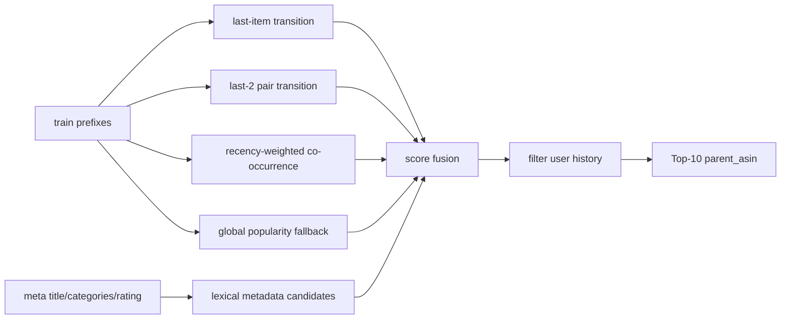

# Amazon Reviews 2023 推荐系统报告

## 任务与评估

本项目按 `PRD.md` 要求，在 `Industrial_and_Scientific`、`Musical_Instruments`、`CDs_and_Vinyl` 三个 Amazon Reviews 2023 5-Core 子集上完成 Top-10 序列推荐。

- 预测目标：`parent_asin`
- 时序依据：`timestamp` 升序后形成的 `history`
- 输出格式：`{"user_id":"...","predictions":["..."],"ground_truth":"..."}`
- 核心指标：单 Ground Truth 的 `NDCG@10`

## 模型

当前交付模型为 `hybrid`，不依赖第三方库，适合在当前环境直接复现。



融合排序信号：

- `last-item transition`：最近一个商品到下一个商品的转移计数。
- `pair transition`：最近两个商品组成的二阶转移。
- `recency co-occurrence`：历史尾部商品对目标商品的共现，按距离衰减。
- `metadata candidates`：从 `meta_*.jsonl.gz` 的标题、类目、店铺词中召回相似商品。
- `popularity fallback`：保证每个用户恰好输出 10 个未交互商品。

## 最终测试集结果

最终产物位于 `outputs/`，命令为：

```powershell
python run.py run-all --data-dir data --output-dir outputs --model hybrid --use-meta
```

| Category | Rows | Hit@10 | NDCG@10 | Prediction file |
| :--- | ---: | ---: | ---: | :--- |
| Industrial_and_Scientific | 50,985 | 0.038188 | 0.023080 | `outputs/Industrial_and_Scientific_test_pred.jsonl` |
| Musical_Instruments | 57,439 | 0.049949 | 0.029289 | `outputs/Musical_Instruments_test_pred.jsonl` |
| CDs_and_Vinyl | 123,876 | 0.079846 | 0.052160 | `outputs/CDs_and_Vinyl_test_pred.jsonl` |

## 验证集消融

| Category | Popularity NDCG@10 | Hybrid No Meta NDCG@10 | Hybrid + Meta NDCG@10 |
| :--- | ---: | ---: | ---: |
| Industrial_and_Scientific | 0.009923 | 0.027715 | 0.028666 |
| Musical_Instruments | 0.015641 | 0.030353 | 0.031180 |
| CDs_and_Vinyl | 0.003038 | 0.055937 | 0.057113 |

结论：顺序信号相比纯热度有明显提升；轻量 metadata 召回在三个类目验证集上均带来正向增益。

上述对照可以用统一实验入口复现：

```powershell
python run.py run-experiments --data-dir data --output-dir experiments --splits valid
```

## 高级路线：SASRec Reranker

已实现 PRD 推荐的 SASRec 深度序列模型路线，作为二阶段重排器使用：

1. `hybrid + meta` 先召回 Top-N 候选。
2. SASRec 使用用户历史序列编码下一个商品偏好。
3. 对候选集合打分重排，输出最终 Top-10。

当前 `recom` 环境已配置 GPU 版 PyTorch：

- `torch 2.11.0+cu128`
- CUDA 可用：`True`
- GPU：`NVIDIA GeForce RTX 5060 Laptop GPU`

GPU smoke test 命令：

```powershell
python run.py sasrec-rerank --category Musical_Instruments --data-dir data --output-dir experiments_sasrec_gpu_smoke --splits valid --use-meta --max-train-rows 2048 --candidate-k 50 --max-len 40 --hidden-size 32 --num-layers 1 --num-heads 2 --batch-size 128 --negatives 16 --epochs 1 --device auto
```

Smoke test 结果：

| Category | Train Rows | Device | Hit@10 | NDCG@10 |
| :--- | ---: | :--- | ---: | ---: |
| Musical_Instruments | 2,048 | cuda | 0.053396 | 0.030616 |

这个 smoke test 的训练行数很少，用于验证 GPU 训练/推理闭环，不代表最终调参上限。完整训练可去掉 `--max-train-rows 2048`，并适当增大 `--hidden-size`、`--num-layers` 和 `--epochs`。

当前版本还新增了正式 SASRec 网格入口：

```powershell
python run.py sasrec-grid --data-dir data --output-dir experiments_sasrec_full_valid --splits valid --use-meta --candidate-k 50 --max-len 50 --hidden-size 64 --num-layers 2 --num-heads 2 --batch-size 512 --negatives 64 --epochs 1 --device auto --base-rank-weight 1.0 --sasrec-score-weight 0.03 --loss ce
```

SASRec 修正与实验更新：

- 修正左填充序列的表示位置：现在取最右侧最近交互位置，而不是 padding 区域。
- 重排方式从纯 SASRec logits 改为 `hybrid base rank + normalized SASRec score` 融合。
- 训练目标默认使用 sampled softmax / cross-entropy，`--loss bce` 可用于消融。

全量训练 1 epoch 的验证集结果如下：

| Category | Train Rows | Device | Hit@10 | NDCG@10 |
| :--- | ---: | :--- | ---: | ---: |
| Industrial_and_Scientific | 259,992 | cuda | 0.046641 | 0.028669 |
| Musical_Instruments | 339,519 | cuda | 0.054284 | 0.031180 |
| CDs_and_Vinyl | 1,181,136 | cuda | 0.087846 | 0.057104 |

结论：GPU SASRec 已经作为 PRD 中的深度序列路线完成工程化闭环，但在当前二阶段候选与 1 epoch 设置下，相比 `hybrid + meta` 主要是持平，尚未形成稳定显著提升。下一步更值得投入的是 SentenceTransformer 文本向量和 LightGCN 图向量，再与 SASRec 分数做多路融合。

## 文本增强：SentenceTransformer Reranker

已实现 PRD 中的 `BERT / SentenceTransformer` 文本增强路线：

1. 从 `meta_*.jsonl.gz` 读取 `title`、`features`、`description`、`categories`、`store`。
2. 为每个 `parent_asin` 构建文本向量。
3. 用用户最近交互商品的文本向量均值作为查询向量。
4. 对 `hybrid + meta` 召回的 Top-50 候选进行 `base rank + text similarity` 融合重排。

支持两种后端：

- `hashing`：无需下载模型，使用哈希词向量，适合快速消融。
- `sentence-transformer`：使用 `sentence-transformers/all-MiniLM-L6-v2`，当前在 GPU `cuda` 上编码，向量维度 384。

复现命令：

```powershell
python run.py text-grid --data-dir data --output-dir experiments_text_st_valid --splits valid --text-backend sentence-transformer --text-model sentence-transformers/all-MiniLM-L6-v2 --candidate-k 50 --batch-size 256 --max-history-items 3 --base-rank-weight 1.0 --text-score-weight 0.05 --device auto --local-files-only
```

验证集结果：

| Category | Hybrid + Meta NDCG@10 | Hashing Text NDCG@10 | SentenceTransformer NDCG@10 |
| :--- | ---: | ---: | ---: |
| Industrial_and_Scientific | 0.028666 | 0.028801 | 0.028851 |
| Musical_Instruments | 0.031180 | 0.031270 | 0.031320 |
| CDs_and_Vinyl | 0.057113 | 0.057218 | 0.057290 |

测试集结果：

| Category | Hybrid + Meta NDCG@10 | SentenceTransformer NDCG@10 |
| :--- | ---: | ---: |
| Industrial_and_Scientific | 0.023080 | 0.023234 |
| Musical_Instruments | 0.029289 | 0.029348 |
| CDs_and_Vinyl | 0.052160 | 0.052340 |

结论：文本向量增强在三类验证集和测试集上均稳定提升，是目前比 SASRec 更直接有效的高级路线。

## 复现与自检

已完成：

- 固定随机种子：`2026`
- 标准库实现：无需 pandas/numpy/torch
- 单元测试：`python -m unittest discover -s tests`
- 格式自检：所有 `*_pred.jsonl` 行均包含 10 个无重复预测，且 `user_id`、`ground_truth` 字段完整
- 独立评估入口：`python run.py evaluate-file --predictions outputs/CDs_and_Vinyl_test_pred.jsonl`

后续若追求更高分，可以继续调参 SASRec，或加入 Sentence-BERT 文本向量模型，并继续沿用当前评估、输出和报告结构。
